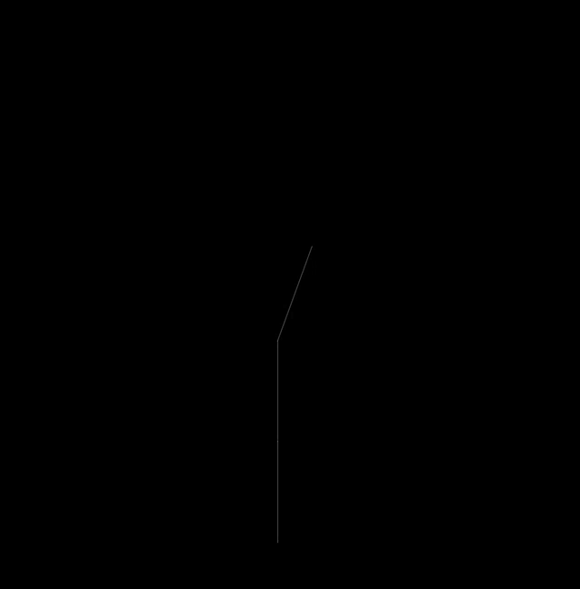

# algorithmic_plants

An algorithmic plant viewer.

This was simply an exercise in implementing a Lindenmayer System, which is a formula for describing the fractal-like growth of multi-cellular organisms using an alphabet mapped to a set of production rules.

After writing the system, I toyed with generating already-known axioms (the initial seed string for the fractal pattern) defined by Lindenmayer, as well as designing my own.

REFERENCES: The Nature of Code by Dan Shiffman and The Algorithmic Beauty of Plants by Lindenmayer & Prunsinkiewicz

Deployed here: http://xie-emily.com/code_art/algorithmic_plants/index.html

